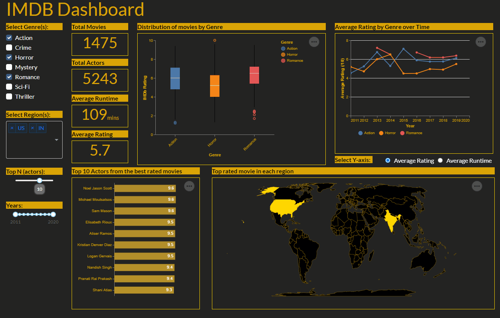
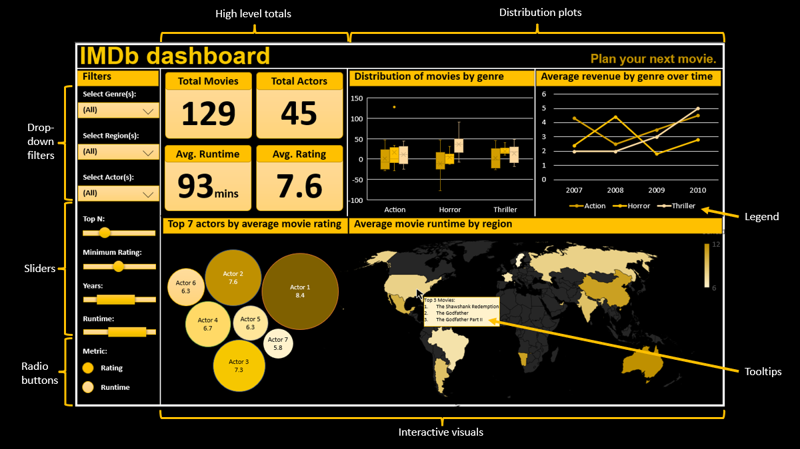

# imdb_dashboard

The IMDb dashboard is primarily targeted towards movie producers to present a consolidated crisp view of the average ratings and runtime for movies by genres and regions with interactive abilities to help them choose and plan their next movie.



## Usage
The link to the app is [here](https://imdbdashboardpy.herokuapp.com/)

Usage examples:
- Select genre from the navigation pane on the left-hand side to filter the plots by genres.
- Select region from the navigation pane on the left-hand side to filter the plots by region.
- Hover over the selected region on the map to view top rated movie of the region.

### Running the app locally

To run the app locally using docker, run the following command:

```bash
docker-compose up
```

## Dashboard description

Our dashboard consists of one web page that shows overall summary and 4 main reactive plots:

- The high level totals

These are a set of 4 numeric totals showing the total count of movies, the average runtime across all movies, the total number of actors across all movies, and the average rating of all movies based on the filters applied.

- The distribution of movie rating by genre

This is a box plot showing the movie rating distribution by genre.

- How movie ratings vary over time

This is a line chart showing the years on the x-axis and the mean rating or runtime on the y-axis. The individual lines are coloured by the genre. The user can choose the average rating or average runtime for the y-axis.

- The top actors from the best rated movies

This is a bar chart showing the top actors from the best rated movies with the movie rating. The user can choose the number of actors that are depicted for each year using a slider.

- A map showing summary statistics about movies produced in each region

Our dataset contains information from various regions around the world, so this map can be used to explore how movie characteristics vary by region. The map will show an aggregation for the movies produced in a particular region (e.g. top movie title and the mean rating).

Additionally, the filters in the navigation pane on the left-hand side allows users to filter the dataset by genres, regions, or actors. Further below we have individual sliders to adjust top N actors and year range. Changing these filters will update the data that is used to generate the plots. The displayed charts will be interactive enabling users to get more granular information through tooltips by hovering over the visuals/data points.

## App sketch



## Contributions

|  Contributor  |  Github Username |
|--------------|------------------|
|  Abdul Moid Mohammed |  @iamMoid |
|  Brandon Lam |  @ming0701  |
|  Nikita Shymberg  |  @NikitaShymberg |

We welcome and recognize all contributions. Please find the guide for contribution in [Contributing Document](https://github.com/UBC-MDS/imdb_dashboard/blob/main/CONTRIBUTING.md).

## Installation
To run the app locally:
1. Install the necessary packages listed in `requirements.txt` using `pip` or `conda`
2. Clone this repo 
3. Navigate to the root of this repo
4. In the command line, enter
```
python src/app.py
```
5. Copy and paste http://127.0.0.1:8050/ to a browser to run the Dash app.

## License

`imdb_dashboard` was created by Abdul Moid Mohammed, Brandon Lam and Nikita Shymberg. It is licensed under the terms of the MIT license.
